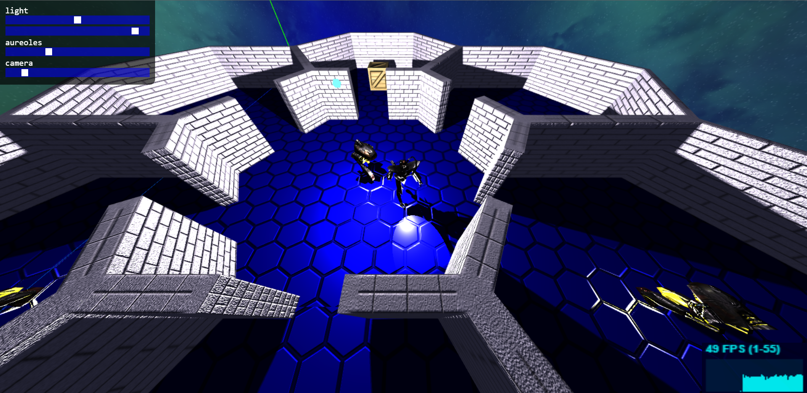
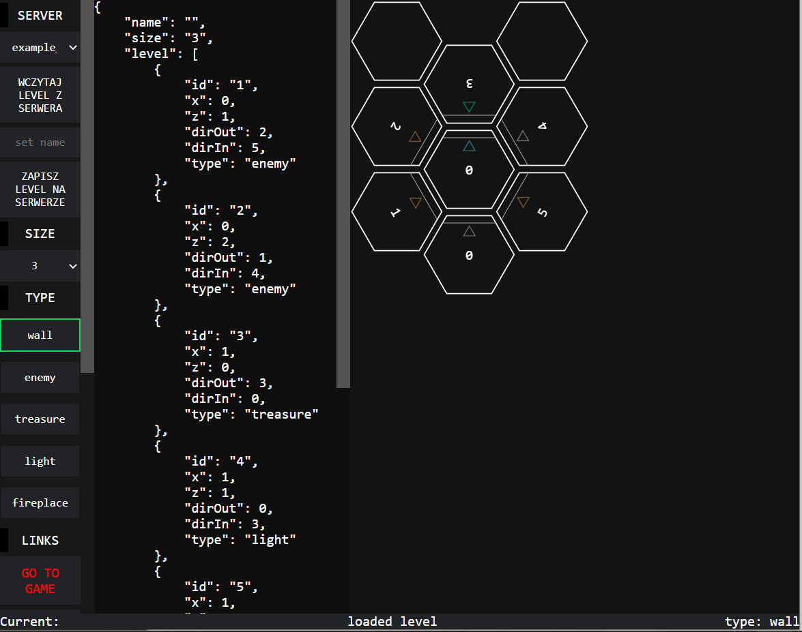
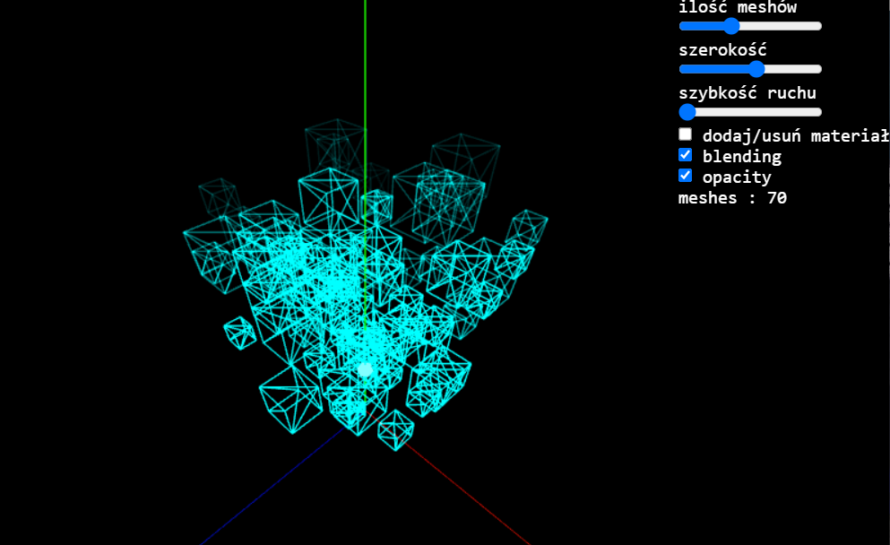
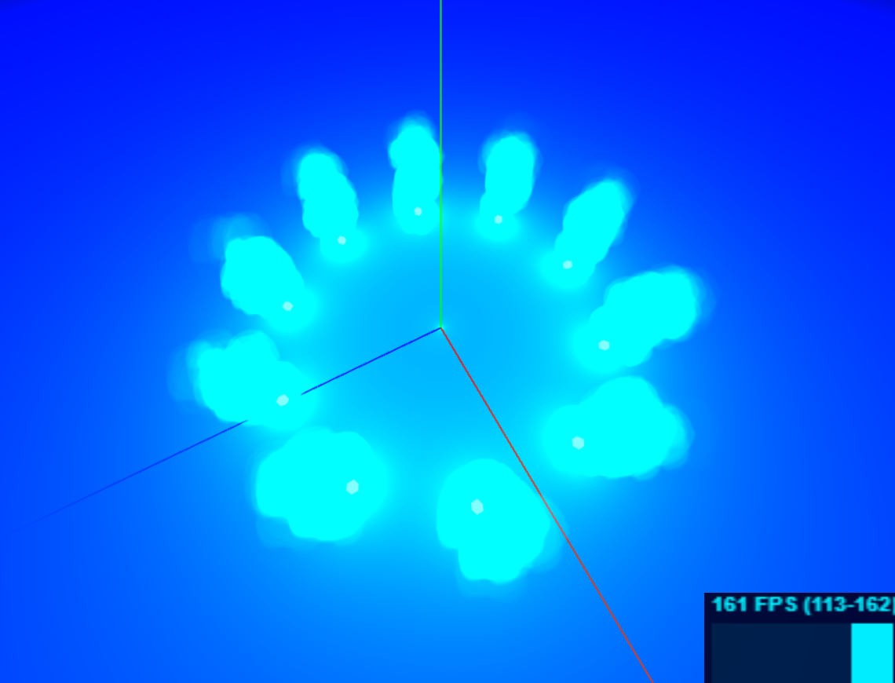

## HEX3D - Playground
This project is my playground for learnig JavaScript Object Oriented Programming and ThreeJS. 
I coded it in 2020 for Client Applications course in Upper-Secondary Schools of Communications.
## Additional information about project
### Run
To run this project type in terminal `npm start`
### Used technology
- HTML, CSS, JavaScript
- ThreeJS
- JQuery
- NodeJS
- ExpressJS

## Screenshots:
### Game

### Level editor

### Particles

### Fireplace

## Some things that I learned:
- Object Oriented Programming
- Writing cleaner code 